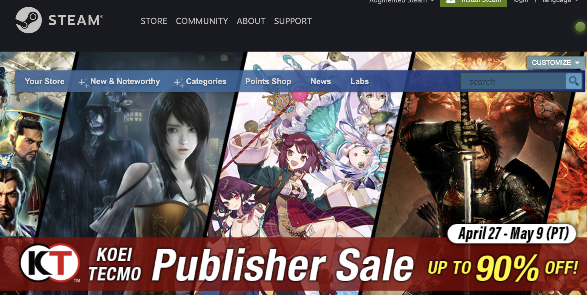
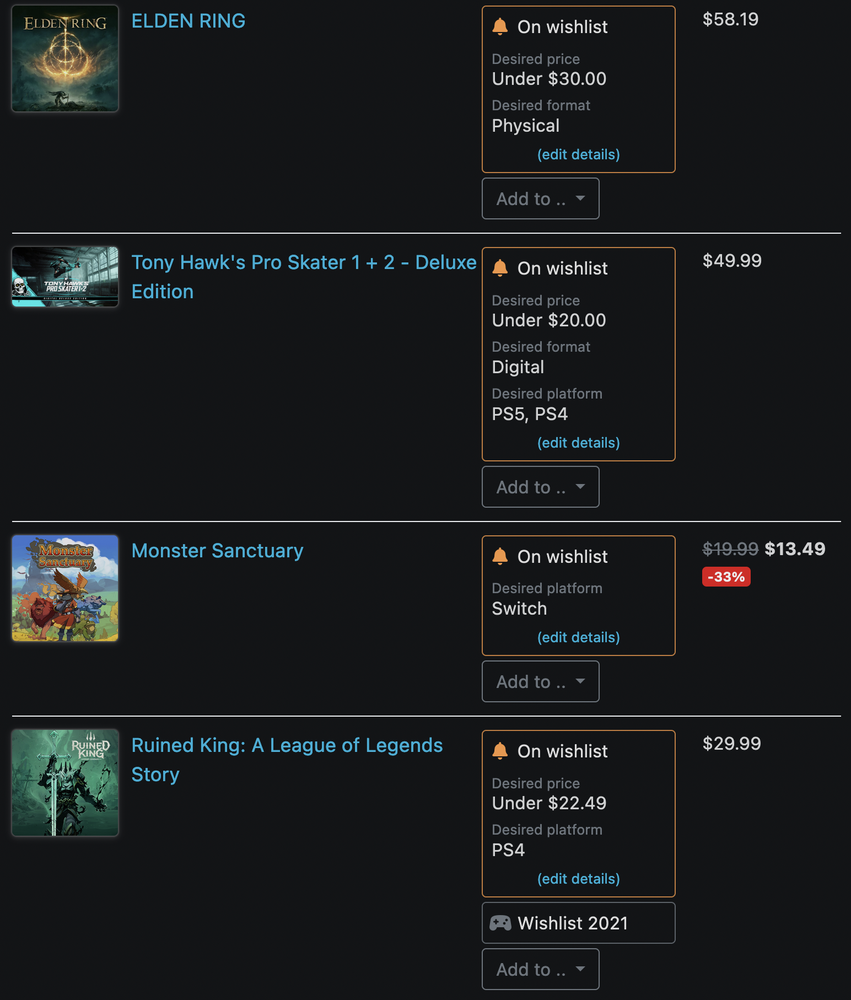

After posting my [yearly media writeup](/blog/post/favorite-media-2021/), I got some questions about how I had access to so many games without spending an arm and a leg. My secret? Claiming free game and tracking deals!

Sites today have made it easy to track when a game goes on sale, if that sale is a good one, and when the last sale was. Couple that with the copious number of free games given away every month, and it's cheap and easy to build up a significant game library.

## For Computers

Computers are the best platform for getting a steady stream of free games. Not all of them are gems, but there are enough good ones to make it all worthwhile. Plus, you can't beat free! Here's the schedule:

**Every Thursday**, [Epic Games](https://store.epicgames.com/en-US/) releases a game or two, totally for free. You make a free account and can claim the games each week. Most are DRM-free and can be launched separately from the Epic launcher (though it tracks time and does cloud sync, so it's generally worth using). They have also historically done daily freebies during holidays, so make sure to check often.

**Every month** (on the 1st of the month, or the first weekday if it's a weekend), Amazon Prime members can claim members can claim a 4-6 DRM-free games on [Amazon Gaming](https://gaming.amazon.com/home). Even better, you keep these games if your prime memberships lapses.

**A few times a year**, Steam does large seasonal sales. The biggest are the Summer and Winter sales (mid-June and mid-December, respectively). Basically every game on Steam is on sale to some degree (unless it's a new release, or [Factorio](https://www.factorio.com/blog/post/fff-140)), so that's the best time to load up on your wishlist. There are also smaller sales throughout the year that cater to specific holidays, genres, publishers, or themes. Check out [steamdb](https://steamdb.info/sales/history/) for recent and upcoming ones.

Past that, it's easy to keep an eye on game sales elsewhere around the web. The best site for this is [isthereanydeal](https://isthereanydeal.com/), which lets you make a wishlist and notifies you if that game goes on sale anywhere. It also has historical sale info, so you know what prices a game has been at in the past (and how recently).

Similarly, sites like [Humble](https://www.humblebundle.com/)(all sorts of games) and [itch.io](https://itch.io/) (mostly indies) do semi-regular bundles, where you get a big pile of games for a fixed price. You're unlikely to want all the games in the bundle (especially if you've been deal hunting for a while), but you can score some great value.

Lastly, you can keep an eye on [/r/gamedeals](https://old.reddit.com/r/GameDeals/). They generally collect all of the above, but it's convenient to have it all in once place. I also enjoy the discussion around "is X game worth it at this price" and learning context you may not find elsewhere ("this game is abandoned, but good").

## For Consoles

For consoles, it's a bit of a different beast. There are way fewer games given away for free, but there are a lot of good sales; it's not all bad!

If you like to own consoles games, best site to track deals across all major platforms is [Deku Deals](https://www.dekudeals.com/). It's got the works:

- data about physical and digital releases across all 3 major platforms
- historical sale data
- wishlists with amazing filtering (by platform, physical/digital, price drop thresholds, etc)
- superb UI

Whenever I'm interested in a console game, I plug it into Deku Deals and use that as my global console wishlist. I get emailed when any sale meets my conditions. I heartily recommend it as a site.

Additionally, for **PlayStation** owners, PS+ is a great value. For a low monthly price, you can add a few games to your account (that you keep forever, but you can only play while you have an active subscription). The games vary pretty wildly in personal relevance, but there are definitely up months. The membership goes on sale every year around Black Friday, so it ends up being ~$3 / month, a total steal. Sony is also [introducing new tiers](https://blog.playstation.com/2022/03/29/all-new-playstation-plus-launches-in-june-with-700-games-and-more-value-than-ever/) to the membership soon, so that's something to keep an eye on if you like the idea of Game Pass.

Speaking of Black Friday, that's the best time of the year to get big savings on physical games. Places like GameStop and Best Buy have huge sales throughout that weekend. It's definitely the best time to stock up on discs.

Finally, there are great deals subreddits for each console. I've collected them, along with `/r/gamedeals` above, into this [helpful multireddit](https://old.reddit.com/user/xavdidtheshadow/m/deals/), if that's your thing.

## Subscription Services

If you don't care about owning your games outright, subscription services are a great option. Much like Netflix, membership lets you play anything in the catalogue as much as you'd like. Games come and go, but it's an unprecedented way to play a wide selection on the cheap. It's not for everyone- if you play a few games for a huge amount of time, then you're better off buying them. But I play many games one time each, so I derive a lot of value from the membership.

Microsoft's [Game Pass](https://www.xbox.com/en-US/xbox-game-pass) is my favorite subscription. There's an expansive selection of AAA and indie alike across a wide range of genres. You can play on either your PC or XBox (or get an "ultimate" subscription to play on both).

Similarly, [Apple Arcade](https://www.apple.com/apple-arcade/) has a good selection of micro transaction-free games that are playable across mobile, tablets, Apple TV, and Mac computers. Mobile games get a bad rap, but there are definitely some hidden gems in Arcade.

## Tracking it All

Of course, if you follow these tips, you'll probably need a way to track if/how you own a given game. There's nothing worse than buying a game only to realize you already own it in a random launcher you never check.

Some PC launchers, like [Playnite](https://playnite.link/) and [GoG Galaxy](https://www.gog.com/galaxy), can help. There's also a great iOS app called [Sofa](https://sofahq.com/) which helps you make nice lists of what you want to play. If you really build up a collection, it may be worth expanding to a spreadsheet or Airtable (like I do; it's a story for another time).

Happy deal hunting!
