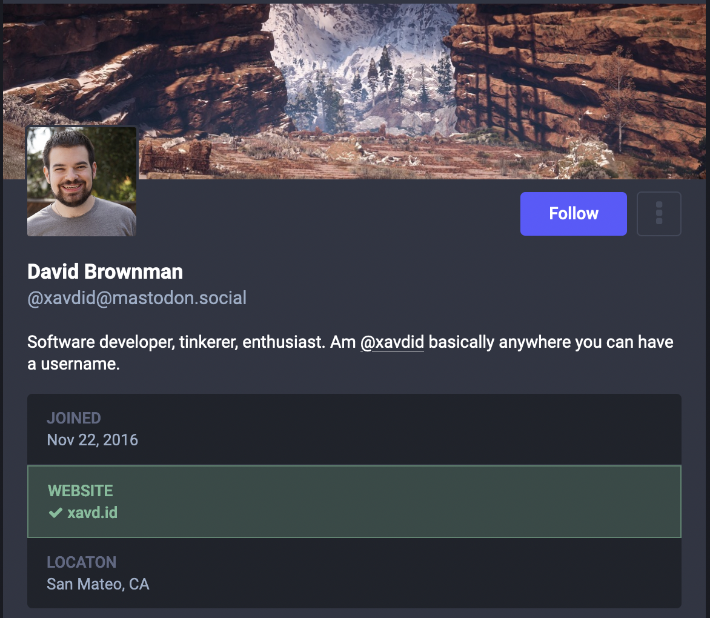

As Twitter users flock to Mastodon, many have been confused about how verification works there. Without a central authority to verify someone's identity, Mastodon uses ownership of a website to prove ownership of an account. This comes in two major flavors: trusted domains and outgoing links.

## Trusted Domains

If you're willing to host your own instance, hosting Mastodon on a known domain is a simple (but not easy) way to prove you own a given profile. If you've established that you control `some-site.com`, then you can pretty convincingly say that `@yourname@some-site.com` is you. This is the approach that [Simon Willison](https://simonwillison.net/) (and many others) have taken: he's `@simon@simonwillison.net`.

More broadly, you can assume that accounts running on an official government domain are themselves official government accounts. The EU itself has piloted this approach. Their domain is `europa.eu` and their Mastodon instance can be found at https://social.network.europa.eu/about. There are already [many accounts](https://social.network.europa.eu/explore) there, each "verified" by virtue of being on a government domain. This is an approach I'd love to see US governments take (rather than relying on Twitter for so much broad communication).

## Outgoing Links

If you (understandably) don't want to host Mastodon yourself, linking _from_ a trusted domain is the next easiest way to verify who you are. Per [the docs](https://docs.joinmastodon.org/user/profile/#verification), you have to add an HTML link on the external site pointing to your Mastodon profile.

When it works, it looks like this:



Because you trust that I, David, own this domain and this domain links to `@xavdid@mastodon.social`, then you can be sure that I, David, am the person behind that profile.

### Verifying Your HTML

To verify your link is constructed correctly, paste the following Javascript snippet into the browser console:

```js
(() => {
  const results = [];
  const links = document.evaluate(
    '//a[contains(concat(" ", normalize-space(@rel), " "), " me ")]|//link[contains(concat(" ", normalize-space(@rel), " "), " me ")]',
    document,
    null,
    XPathResult.ANY_TYPE,
    null
  );
  while ((node = links.iterateNext())) {
    results.push(node.href);
  }
  console.log("Found links to the following profile(s):");
  console.log(results.map((l) => `  * ${l}`).join("\n"));
})();
```

It uses the browser's [XPath API](https://developer.mozilla.org/en-US/docs/Web/XPath) and the [exact same algorithm](https://github.com/mastodon/mastodon/blob/d26c1cb2fe145b8d56a9c15e110a917e6f63068b/app/services/verify_link_service.rb#L29) that Mastodon uses to detect profile links. It should help you confirm that your verification link will be picked up my Mastodon after you save your profile. I found it especially useful when the verification service on `mastodon.social` was being spotty and I wasn't sure if I had set my site up correctly or not.

## Downsides

Both of the approaches mentioned above are undoubtedly power-user features.

Most folks (myself included) don't want to bother hosting an entire social media site. Alternatively, you have to have enough control over the sites you add to your profile to add custom HTML to them. While it doesn't sound like much, folks without dedicated domains or who use off-the-shelf site builders may not be able to do that. Lastly, verification is done on a per-instance basis. If your verification links don't stay live forever it's possible for parts of your profile to show as verified on some Mastodon servers but not on others.

These are all serious drawbacks as compared to Twitters verification efforts (RIP) when it comes to imparting legitimacy to those who need it. But, it's a great start and I'm confident we'll be able to improve the system for everyone over time.

Until then, don't believe everything you see!
